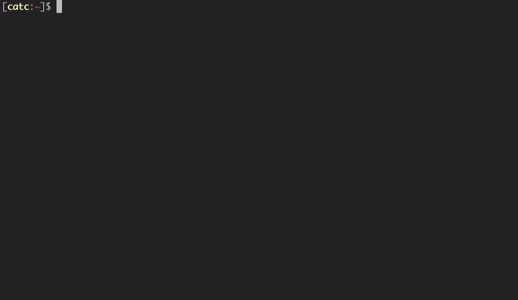

<h1 align="center">
	
	<br/>
	c
</h1>

A somewhat more sane method of writing CLI scripts in typescript.

- :metal: easily write scripts; just create basic js scripts with full [commander.js](https://github.com/tj/commander.js) support
- :passport_control: full typescript support, no extra config required!
- :keyboard: supports shell autocomplete for commands
- :file_cabinet: nest commands and subcommands, you control how everything is organized

**Note that only `zsh` is currently supported** - adding support for bash/fish/whatever should be relatively easy. Follow [instructions on what to change](./src/misc/supporting-other-shells.md) and open a PR.


## Installation
To install, run:
```sh
bash <(curl -s https://raw.githubusercontent.com/catc/c/master/scripts/init.sh ) install
```

This will git clone the repo, yarn/npm install, prompt you for the CLI bin name and add it to your path.

### Getting started

Just run `c new` to create a new command. If you're using vscode ([and your path supports `code`](https://code.visualstudio.com/docs/setup/mac#_launching-from-the-command-line)), you can also do `c dev` to open the `commands/` dir for easy development.


## Built in commands

#### `c new`
Creates new command and generates file, prompts for command name.

#### `c implode`
Removes from path and deletes repo.

#### `c dev`
Opens `commands/` folder in vscode for development.

